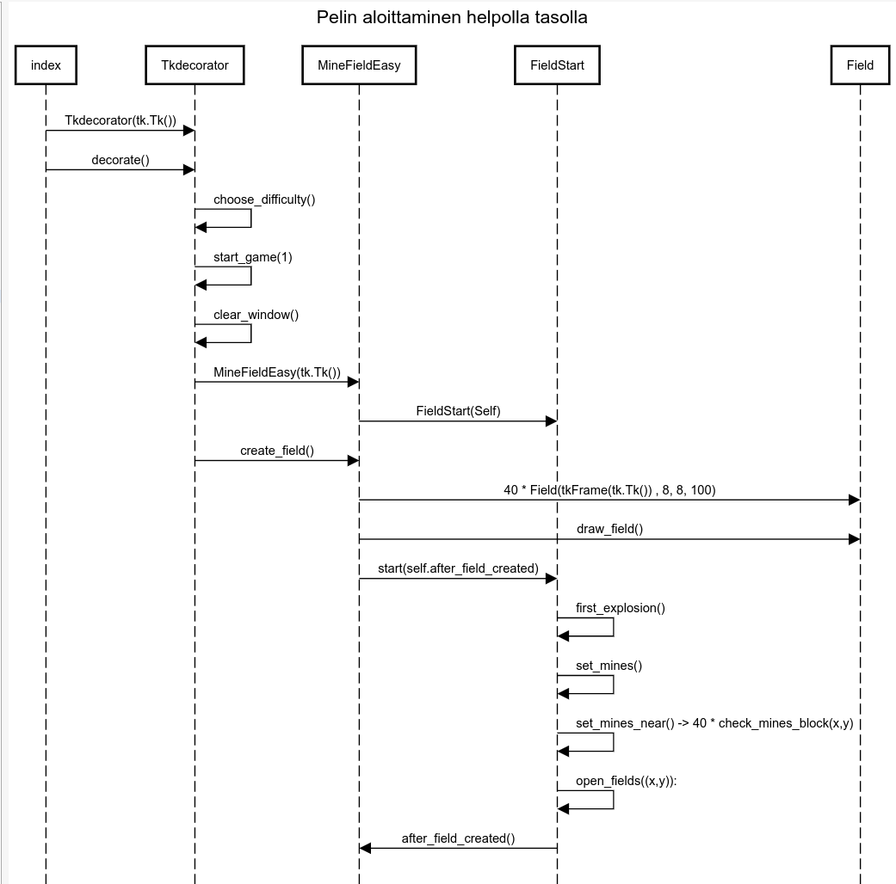

# Arkkitehtuurikuvaus

## Sovelluslogiikka

### Toiminnallisuudet

Tkdicartir-luokka hoitaa yleisesti dekoraatio toiminnallisuuden ja piirtämisen. Sen tehtävänä on hoitaa pelin aloituksen piirtämisen ja valitsee säätää oikean vaikustason. MineFiedMedium-luokka hoitaa miinaharavan alustuksen ja apuluokkien kutsut. Se hoitaa koko pelin tilaa ja tarkistaa mikäli peli on voitettu vai ei. Field-luokka vastaa yksittäisen alueen tilasta. Se hoitaa myös alueen kuvan piirtämisen ja taustoista. MineieldStart-luokka hoitaa pelin alkutoimenpiteet. Se hoitaa miinojen alustamisen endimmäisen klikauksen jälkee, sekä tyhjän alueen klikkauksesta seuraavaan viereisten alueiden avauksen.

## Päätominnaiisuudet

### Pelint aloittaminen

