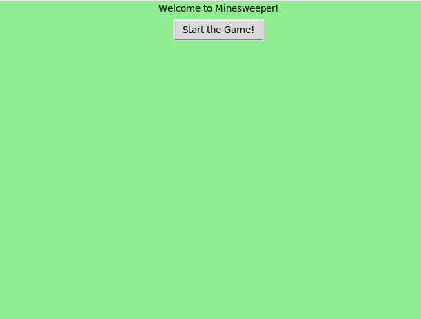
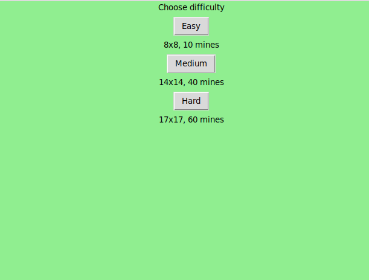
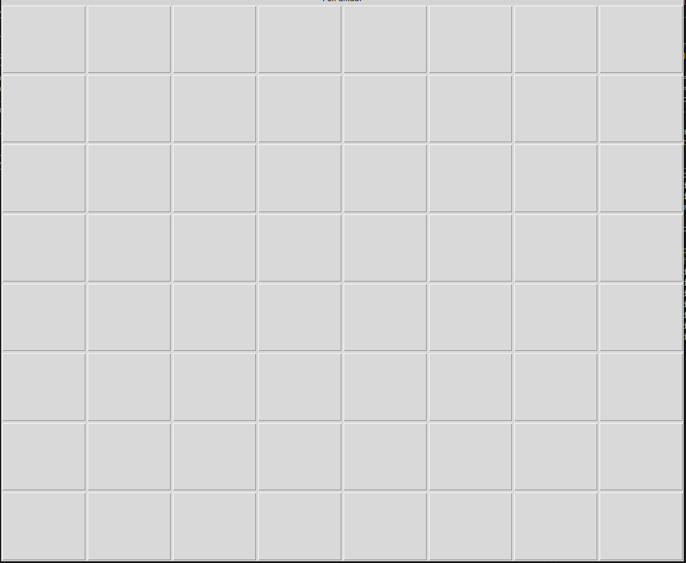

# Käyttöohje

## Käynistys

1. Asenna riippuvuudet komennolla:

poetry Install

2. Suoria vaaditavat alustustoimet komennolla:

poetry run invoke build

3. Käyistä sovellus:

poetry run invoke start

## Aloitus

Alota peli painamalla Start-nappia

## Vaikeustason valitseminen

Valitse itselleen sopiva vaikeus tasosta kolmesta. Vaikeustasot vaihtelevat miinaharavan koolla ja miinojen määrällä.

## Pelin aloitus

Aloita peli painamalla jotain aluetta!

## Pelaaminen

Tapahtuu useamman alueen avautuminen ja voitte alkaa pelaa klassista miinaharavaa. Jos osut miinaan, niin häviät. Mikäli saat avattua kaikki alueen joissa ei ole miinoja niin voitat.

