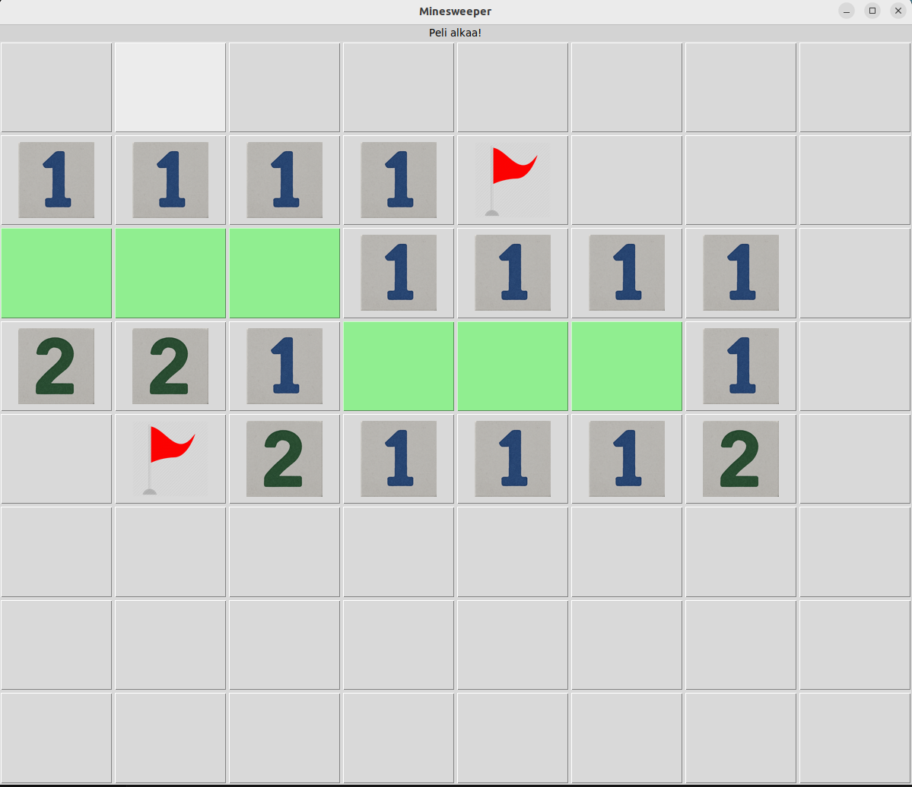

# Käyttöohje

## Käynistys

1. Asenna riippuvuudet komennolla:

poetry Install

2. Suoria vaaditavat alustustoimet komennolla:

poetry run invoke build

3. Käyistä sovellus:

poetry run invoke start

## Aloitus

## Vaikeustason valitseminen

## Pelin aloitus

## Pelaaminen

